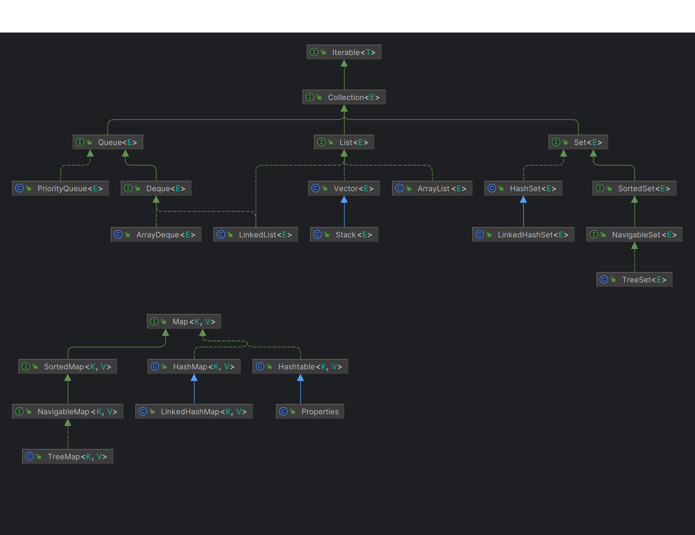

# Collection Framework In Java

The Collection in Java is a framework that provides an architecture to store and manipulate the group of objects.

**Note: This doc only provides brief descriptions for quick reference**

## Quick Review
All the collections are of type **Collection** and this has some generic methods such as
**add, addAll, clear, contains, containsAll, remove, removeAll, size, toArray, isEmpty**

Interfaces which directly extends the Collection interface or provides the base of different type of Collections are
*Queue*, *List* and *Set*.

### List vs Set vs Queue

**List** is an ordered collection (like a sequence). User can precise control over where to add/remove  the element
in the list. It allows duplicates. So support this index based **add, remove** methods are available.
You can also find the index/position of an element using **indexOf, lastIndexOf** methods.

**Queue** is also an ordered collection. But you can add the elements at the end and remove/view the beginning of the 
queue. It allows duplicates. Additional methods supporting the same are **offer, peek, poll**.

A **Set** is not ordered and cannot contain duplicates. You can add, remove and check if the element exists in the Set 
or not. This does not provide any additional methods.

### List Implementations (Go through example codes for better understanding)

#### 1. ArrayList
Resizable-array implementation of the List interface. Implements all optional list operations, and permits all elements,
including null. In addition to implementing the List interface, this class provides methods to manipulate the size of 
the array that is used internally to store the list. (This class is roughly equivalent to Vector, except that it is not synchronized.)

#### 2. Vector
Vector is similar to ArrayList except methods are synchronized.

#### 3. Stack
The Stack class represents a last-in-first-out (LIFO) stack of objects. It extends class Vector with five operations 
that allow a vector to be treated as a stack. The usual **push** and **pop** operations are provided, as well as a method 
to **peek** at the top item on the stack, a method to test for whether the stack is **empty**, and a method to **search** 
the stack for an item and discover how far it is from the top.

A more complete and consistent set of LIFO stack operations is provided by the Deque interface and its implementations, 
which should be used in preference to this class. For example:

Deque<Integer> stack = new ArrayDeque<Integer>();

#### 4. LinkedList (also implements **Deque**)
Doubly-linked list implementation of the List and Deque interfaces. Implements all optional list operations, and permits 
all elements (including null).
All the operations perform as could be expected for a doubly-linked list. Operations that index into the list will 
traverse the list from the beginning or the end, whichever is closer to the specified index.